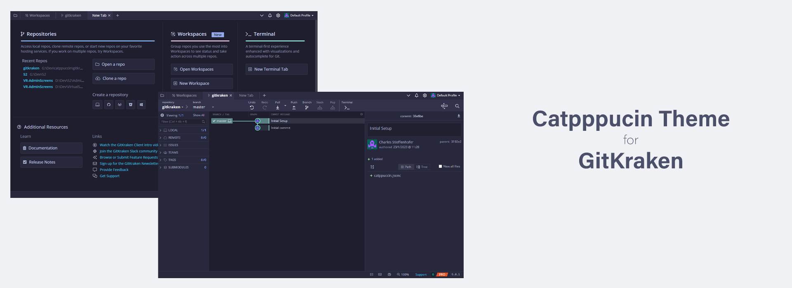

# Catppuccin Theme for GitKraken

Quick and dirty catppuccin theme for GitKraken 🤷

## Theme Support

- ✅ Latte
- ✅ Frappe
- ✅ Macchiato
- ✅ Mocha

## Installation

Obtain the .jsonc files from the release tab. If you want to recompile the asset files in order to add your own color overrides, please check the "Compiling" section.

Copy the Jsonc theme files you want into your GitKraken Theme directory, and Voila ! the themes are availablie in the preferences.

_You can find your GitKraken Theme directory by going into your GitKraken Preferences in the UI Customization menu, on Windows it usually is `%appdata%/.gitkraken/themes`_

## Compiling

This project uses the [Whiskers](https://github.com/catppuccin/whiskers) templating engine starting from 1.0.0. This enables you to add your own color overrides if needed.

To reprocess the jsonc files :

- Download and install [Whiskers](https://github.com/catppuccin/whiskers)
- Download this project and unzip it somewhere
- Run `whiskers gitkraken.tera` in the root of the project

Once this is done, the jsonc files in the `./themes` folder will be ready to be used as described in section "Installation"

## Contributors

@askerad

@Paracetamol56
