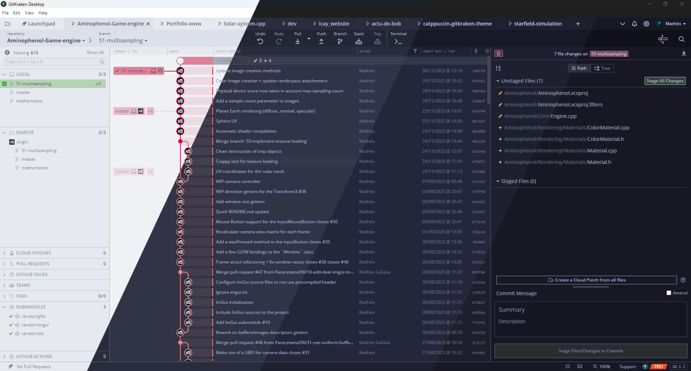
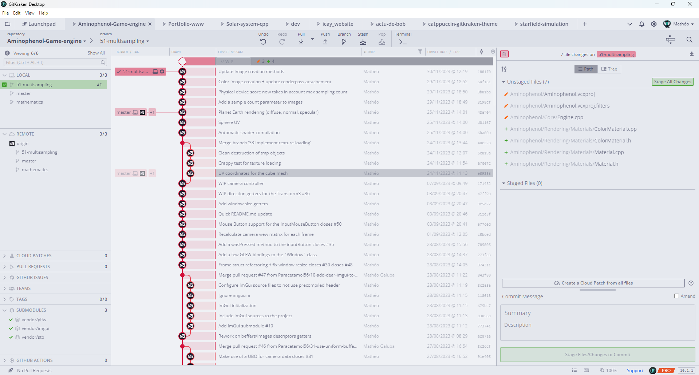
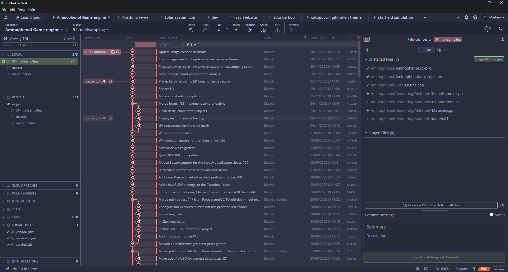
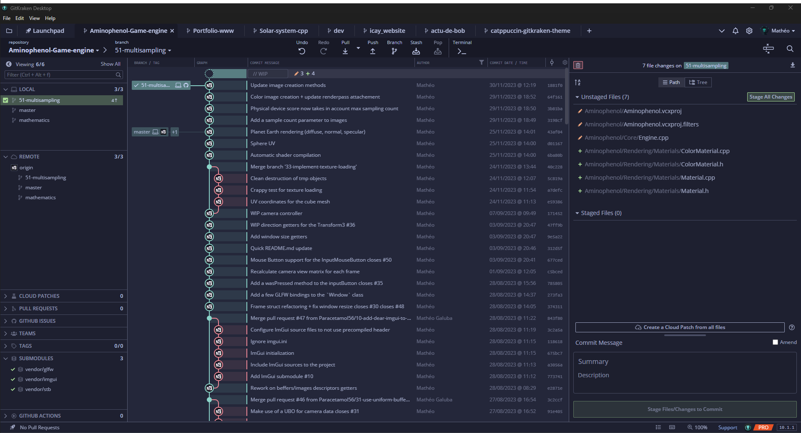

<h3 align="center">
	 
	
	Catppuccin for <a href="https://www.gitkraken.com/">GitKraken</a>
	
</h3>

	
	
	

	

## Previews

🌻 Latte

🪴 Frappé

🌺 Macchiato

🌿 Mocha

## Usage

1. Download your preferred flavor from the [themes](themes/) directory.
2. Copy the `.jsonc` theme file into your GitKraken Theme directory.
  - On Windows it’s usually located at `%appdata%/.gitkraken/themes`
  - While on Unix-based systems it’s located at `~/.gitkraken/themes`
3. In GitKraken, go to Settings → UI Customization → Theme and select the newly added theme.

## 💝 Thanks to

- [Askerad](https://github.com/Askerad)
- [Paracetamol56](https://github.com/Paracetamol56)

&nbsp;

	

	Copyright &copy; 2021-present <a href="https://github.com/catppuccin" target="_blank">Catppuccin Org</a>

	

